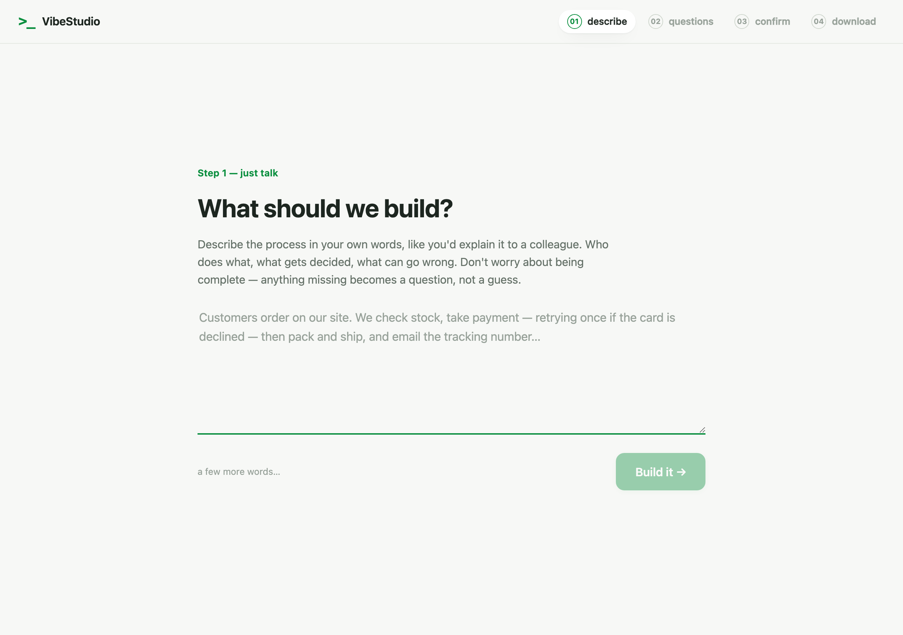
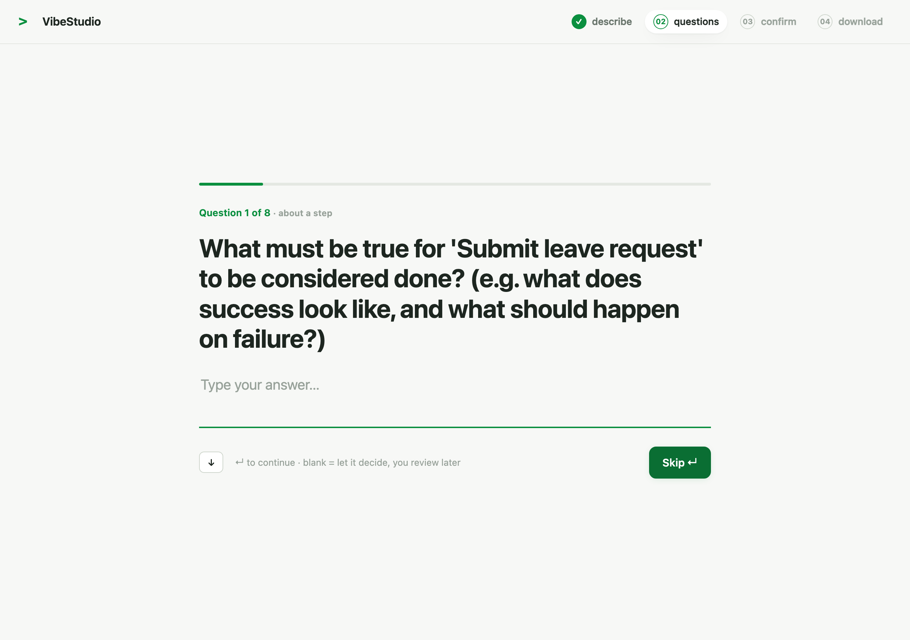
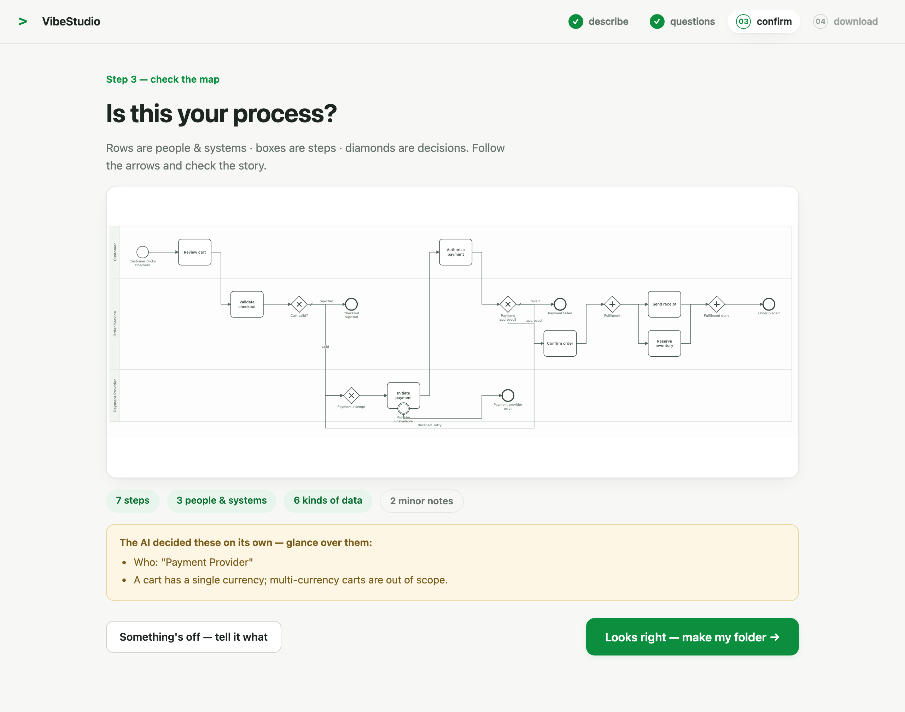
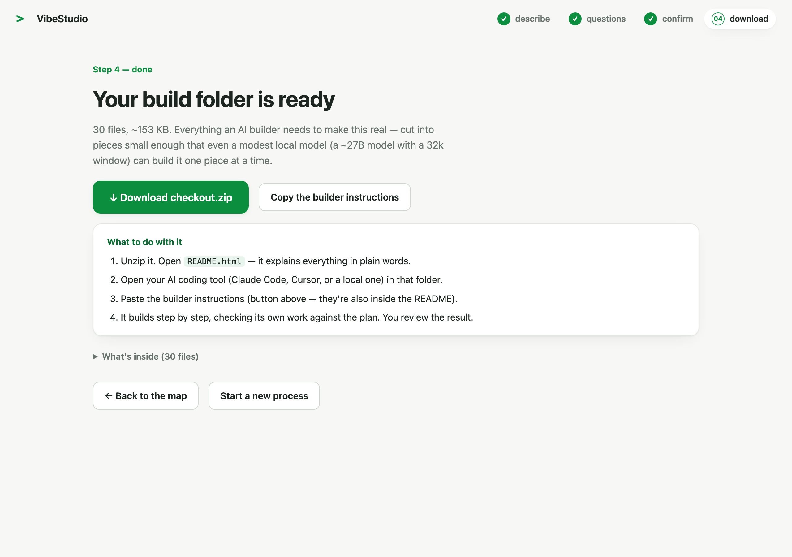

<div align="center">

# `>_` VibeStudio

**Describe how your business works, in plain words.<br>Walk away with a folder any coding agent can build.**

</div>

---

VibeStudio turns a plain-language description of a business process into a **verified build folder** — a diagram, a spec kit, per-step data contracts, a build plan, and troubleshooting notes — cut into pieces small enough that even a modest local model can build them one at a time.

Its defining property: **it never guesses.** Everything the description leaves open becomes a question only you can answer. Everything the AI infers is flagged for your review before you commit. Between the AI and you sits a deterministic validator that checks every draft against 40 structural rules and hands its complaints straight back to the model.

<div align="center">




</div>

## How it works

```
you describe it  →  AI drafts a Process IR  →  validator checks 40 rules
                          ↑                            │
                          └──── fix instructions ──────┤  (up to 3 rounds, automatic)
                                                       │
                                    questions only you can answer
                                                       ↓
                    you answer / skip  →  confirm the diagram  →  download the folder
```

Everything downstream — diagram, specs, plan, notes, cover page — is **generated from one document**, the Process IR, and never authored independently. That is why the diagram, the specs and the build plan cannot drift apart: there is nothing to keep in sync.

**Four steps:** Describe → Questions → Confirm → Download.

- **Describe** — write it the way you'd explain it to a colleague. Incomplete is fine.
- **Questions** — one at a time, in plain language. Skipping is safe: a skipped question becomes an assumption the AI makes *and shows you* on the next screen.
- **Confirm** — your process as a swimlane diagram, with everything the AI decided on its own called out for review. "Something's off" sends free-text corrections back through the model.
- **Download** — a folder, ready to hand to a coding agent.

## What's in the folder

| File | What it is | For |
|---|---|---|
| `README.html` | Plain-language cover page: what you said, what you got, what to do with it | You |
| `process.ir.json` | The validated process — the single source of truth everything else is generated from | Your AI builder |
| `process.bpmn` | Standard BPMN 2.0 — opens in Camunda, Signavio, bpmn.io | Diagram tools |
| `diagram.svg` | The picture, viewable in any browser | You |
| `speckit/` | Constitution, specification, build plan, and one data contract per flow between steps | Your AI builder |
| `plan/graph-plan.json` | Machine-readable work packets: contracts in/out, loops with exit conditions, gateway routing | Your AI builder |
| `notes/troubleshooting.md` | Symptom → which step, decision, loop or data record to investigate | You |
| `notes/codebase.md` | A plain-words map of the code, written by the builder as it goes | You |

Point any coding agent at the unzipped folder and paste the included kick-off prompt. Each work packet is self-contained — contracts in, contracts out, Given/When/Then criteria — so **no step ever needs the whole project in context.** A harness driving a local ~27B model with a 32k window can build it packet by packet, and the kick-off prompt makes it fill in the troubleshooting and codebase notes as it works.

## Quick start

```bash
npm install
npm test                    # 226 tests across the three libraries
npm run dev                 # builds the libraries, serves the wizard on :5173
```

The wizard needs a model. Put a key in `apps/web/.env.local`:

```
OPENROUTER_API_KEY=sk-or-v1-...
```

It is read **server-side only** by the vite proxy (`/api/openrouter`) and is deliberately not `VITE_`-prefixed, so it can never reach the browser. There is no key UI — users are never asked for one. Any OpenAI-compatible gateway works: change `ENDPOINT` and `MODELS` in `apps/web/src/lib/agent.ts`. Defaults are two free models with automatic fallback.

Validate a process document from the command line:

```bash
cd packages/ir
npx tsx src/cli.ts validate examples/checkout.ir.json                                # clean
npx tsx src/cli.ts validate examples/leave-request.draft.ir.json --mode draft --questions
npx tsx src/cli.ts validate examples/invalid/checkout-broken.ir.json                 # 5 errors, each with a fix hint
```

## Repository

| Package | Tests | Purpose |
|---|---|---|
| [`packages/ir`](packages/ir) | 104 | Process IR v1: JSON Schema, TypeScript types, the deterministic 40-rule validator (draft/final modes), model-feedback formatter, clarifying-question extractor, CLI |
| [`packages/bpmn`](packages/bpmn) | 36 | IR → BPMN 2.0 XML with a deterministic layered swimlane layout (BPMNDI). Dependency-free at runtime |
| [`packages/speckit`](packages/speckit) | 86 | IR → spec kit, machine-readable graph plan, and the troubleshooting/codebase note scaffolds |
| [`apps/web`](apps/web) | — | The wizard. Fully client-side; verified in-browser |
| `packages/orchestrator` | planned | The harness that consumes `graph-plan.json` and drives the build |

**Stack:** TypeScript end-to-end, React + Vite, vitest. Node ≥ 20. No backend — validation, BPMN generation, layout, spec-kit generation and zipping all run in the browser.

## Design notes

Two decisions worth knowing about:

- **The diagrams are ours.** We render BPMN-style SVG from our own layout engine rather than embedding a viewer library, because the obvious library's license requires a visible watermark. The exported `.bpmn` keeps full interoperability with real BPMN tools.
- **`gap` is a first-class severity.** The validator's rules resolve to `error` (the model must fix it), `warning` (surfaced, non-blocking), or **`gap` — a question only a human may answer.** That third severity is what makes "it never guesses" mechanical rather than aspirational.

## Documentation

| Doc | What it covers |
|---|---|
| [`docs/process-ir-v1.md`](docs/process-ir-v1.md) | The Process IR design and the full 40-rule catalogue with per-mode severities — read before touching the validator |
| [`docs/devkit/`](docs/devkit/README.md) | VibeStudio documented the way it documents what it builds: codebase map, troubleshooting guide, development spec kit, and a P1–P14 graph plan (with loops) detailed enough to recreate this repository |
| [`docs/design-handoff.md`](docs/design-handoff.md) | Product, audience, brand rules, every screen and state, and the open design problems |

## Status

v0.1 — the full pipeline works end to end: description in, verified build folder out. 226 tests green; typecheck and production build clean.

Next: `packages/orchestrator`, so VibeStudio can drive the build itself instead of handing the folder to someone else's agent.
